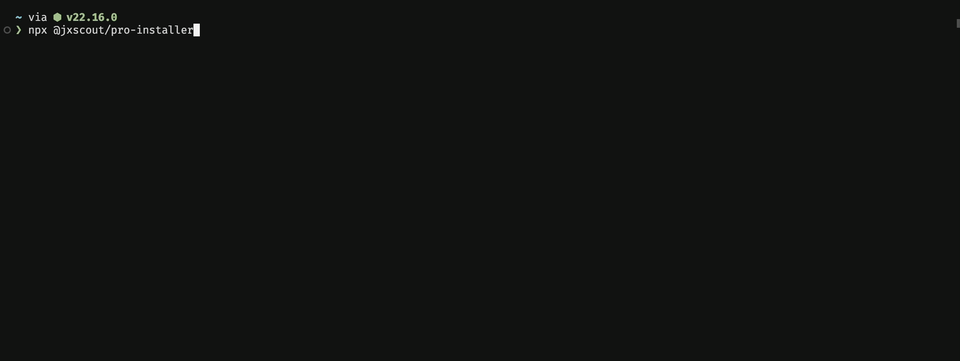

# @jxscout/pro-installer

This package helps you install and update jxscout pro [https://jxscout.app/](https://jxscout.app/) on your computer.

It will automatically detect and install the right CLI version for your OS, install required dependencies and setup the VSCode dependency.

## Usage

Simply run and follow the instructions on the CLI

```
npx @jxscout/pro-installer@latest
```

Requirements:

- npm


